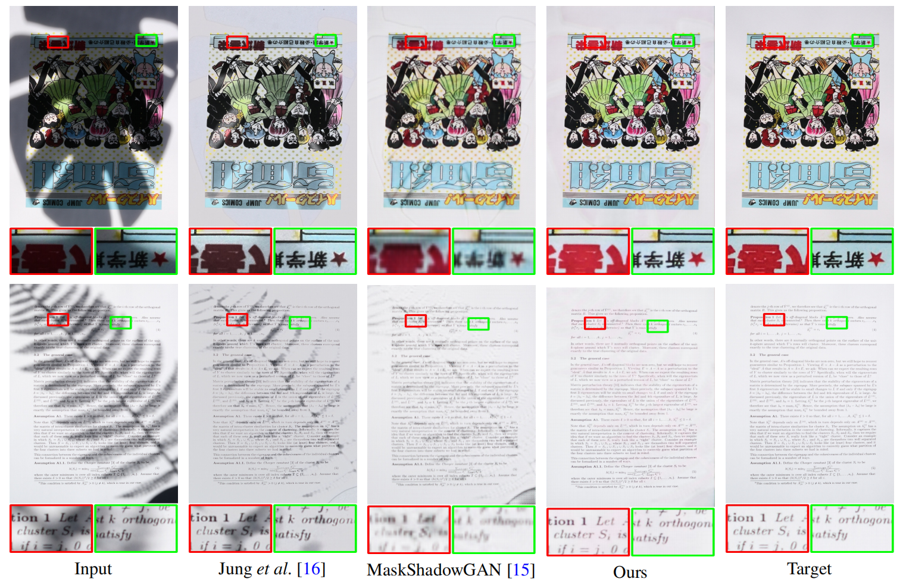
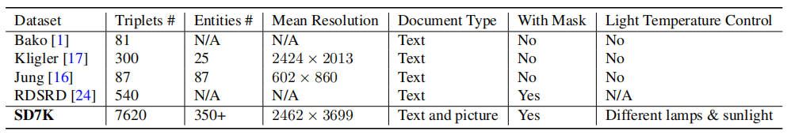
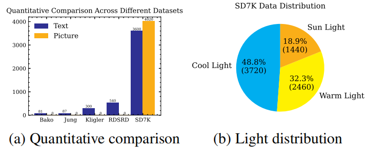

# 📋 High-Resolution Document Shadow Removal

<b><a href='https://arxiv.org/abs/2308.14221'>High-Resolution Document Shadow Removal via A Large-Scale Real-World Dataset and A Frequency-Aware Shadow Erasing Net.</a> </b>
<div>
<span class="author-block">
  <a href='https://zinuoli.github.io/'>Zinuo Li</a><sup> 👨‍💻‍ </sup>
</span>,
  <span class="author-block">
    <a href='https://cxh.netlify.app/'> Xuhang Chen</a><sup> 👨‍💻‍ </sup>
  </span>,
  <span class="author-block">
    <a href="https://www.cis.um.edu.mo/~cmpun/" target="_blank">Chi-Man Pun</a><sup> 📮</sup>
  </span> and
  <span class="author-block">
  <a href="http://vinthony.github.io/" target="_blank">Xiaodong Cun</a><sup> 📮</sup>
</span>
  ( 👨‍💻‍ Equal contributions, 📮 Corresponding )
</div>

<b>University of Macau</b>

In <b>_International Conference on Computer Vision 2023 (ICCV 2023)_</b>


[Paper](https://arxiv.org/abs/2308.14221) | [Website](https://cxh-research.github.io/DocShadow-SD7K/) | [Dataset OneDrive](https://monashuni-my.sharepoint.com/:f:/g/personal/zlii0362_student_monash_edu/EoiaDzQYCplJv0Tfvzj2nKcBquHcFUQKLXCeX0pI8Arjyw?e=fmJrDK) | [Dataset OpenXLab](https://openxlab.org.cn/datasets/lkljty/ShadowDocument7K) | [Weights](https://github.com/CXH-Research/DocShadow-SD7K/releases/tag/Weights) | [Wandb Log](https://wandb.ai/xuhangc/shadow/runs/3n6dlkn5)
---


# 🔮 Dataset
<b>If you are using HPC, we highly recommend you to download SD7K via [Dataset OpenXLab](https://openxlab.org.cn/datasets/lkljty/ShadowDocument7K). For downloading the compared Kligler and Jung datasets, please refer to [Kligler](https://www.kaggle.com/datasets/xuhangc/kliglers-dataset) and [Jung](https://www.kaggle.com/datasets/xuhangc/jungs-dataset).</b>

SD7K is the <b>only large-scale high-resolution dataset</b> that satisfies all important data features about document shadow currently, which covers a large number of document shadow images.

We use <b>over 30 types</b> of occluders along with more than 350 documents to contribute to the dataset. These occluders have the shape of both regular and irregular forms, which provides adequate coverage for various situations. For more information, you can refer to the <a href="https://cxh-research.github.io/DocShadow-SD7K/">demo</a> and <a href="https://arxiv.org/abs/2308.14221">paper</a>.




# ⚙️ Usage
## Installation
```
git clone https://github.com/CXH-Research/DocShadow-SD7K.git
cd DocShadow-SD7K
pip install -r requirements.txt
```

## Training
You may <a href="https://cxh-research.github.io/DocShadow-SD7K/">download</a> the dataset first, and then specify TRAIN_DIR, VAL_DIR and SAVE_DIR in the section TRAINING in `config.yml`.

For single GPU training:
```
python train.py
```
For multiple GPUs training:
```
accelerate config
accelerate launch train.py
```
If you have difficulties with the usage of `accelerate`, please refer to <a href="https://github.com/huggingface/accelerate">Accelerate</a>.

## Inference
Please first specify TRAIN_DIR, VAL_DIR and SAVE_DIR in section TESTING in `config.yml`.
```
python infer.py
```
If you need pre-trained models on SD7K, please download <a href="https://github.com/CXH-Research/DocShadow-SD7K/releases/tag/Weights">here</a>.

<p>For the results of all baselines and our results on SD7K, please refer <a href="https://github.com/CXH-Research/DocShadow-SD7K/releases/tag/Results">here</a>.</p>

# 💗 Acknowledgements
We would like to thank <a href="https://github.com/fabio-sim/DocShadow-ONNX-TensorRT">DocShadow-ONNX-TensorRT</a> for the implementation of our work. If you are looking for easier implementation, please refer to them. We also appreciate the great open-source datasets, please refer to [Kligler](https://www.kaggle.com/datasets/xuhangc/kliglers-dataset) and [Jung](https://www.kaggle.com/datasets/xuhangc/jungs-dataset) for downloading.</b>

# 🛎 Citation
If you find our work helpful for your research, please cite:
```bib
@InProceedings{Li_2023_ICCV,
    author    = {Li, Zinuo and Chen, Xuhang and Pun, Chi-Man and Cun, Xiaodong},
    title     = {High-Resolution Document Shadow Removal via A Large-Scale Real-World Dataset and A Frequency-Aware Shadow Erasing Net},
    booktitle = {Proceedings of the IEEE/CVF International Conference on Computer Vision (ICCV)},
    month     = {October},
    year      = {2023},
    pages     = {12449-12458}
}
```


