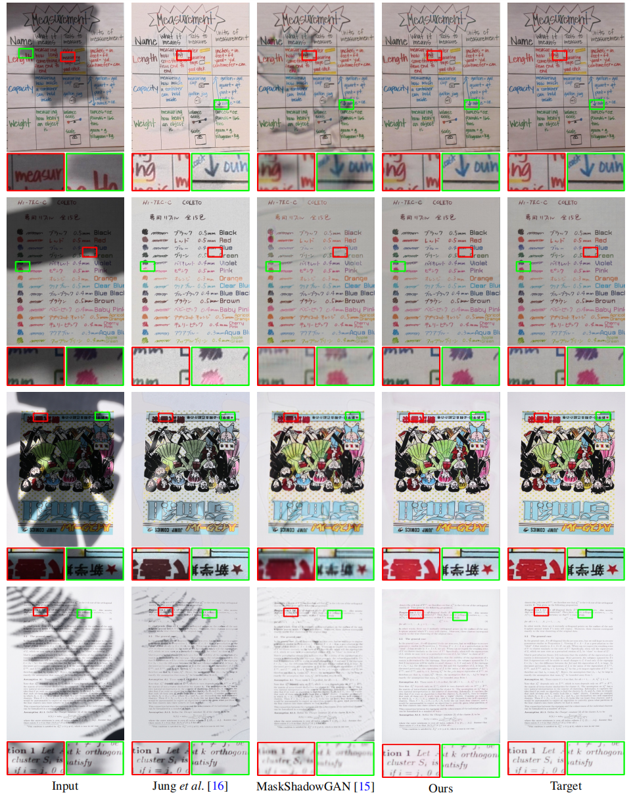

# High-Resolution Document Shadow Removal

<b><a href='https://arxiv.org/abs/2308.14221'>High-Resolution Document Shadow Removal via A Large-Scale Real-World Dataset and A Frequency-Aware Shadow Erasing Net. (ICCV 23')</a> </b>

<b>University of Macau</b>

<div>
<span class="author-block">
  <a href='https://zinuoli.github.io/'>Zinuo Li</a><sup> 👨‍💻‍ </sup>
</span>,
  <span class="author-block">
    <a href='https://cxh.netlify.app/'> Xuhang Chen</a><sup> 👨‍💻‍ </sup>
  </span>,
  <span class="author-block">
    <a href="https://www.cis.um.edu.mo/~cmpun/" target="_blank">Chi-Man Pun</a><sup> 📮</sup>
  </span> and
  <span class="author-block">
  <a href="http://vinthony.github.io/" target="_blank">Xiaodong Cun</a><sup> 📮</sup>
</span>
  ( 👨‍💻‍ Equal contributions, 📮 Corresponding )
</div>

<br>
<p>This is the official repository for the ICCV2023 paper: <b>High-Resolution Document Shadow Removal via A Large-Scale Real-World Dataset and A Frequency-Aware Shadow Erasing Net</b>. Here we offer links to the code, pre-trained models and information on the SD7K dataset. Please raise a Github issue if you need assistance of have any questions on the research. </p>


[Paper](https://arxiv.org/abs/2308.14221) | [Website](https://cxh-research.github.io/DocShadow-SD7K/) | [Datasets SD7K (Baidu)](https://pan.baidu.com/s/1PgJ3cPR3OYO7gwF1o0DgDg?pwd=72aq) | [Datasets SD7K (OneDrive)](https://uofmacau-my.sharepoint.com/:f:/g/personal/yc17491_umac_mo/Egvya1y-c2pDneH-prp8NJABl67potyJ-y0mlLpuKNlBrw?e=FkeJsz)
---


### Installation
```
git clone https://github.com/CXH-Research/DocShadow-SD7K.git
cd DocShadow-SD7K
pip install -r requirements.txt
```

### Training
You may first specify TRAIN_DIR, VAL_DIR and SAVE_DIR in section TRAINING in config.yml.

For single GPU traning:
```
python train.py
```
For multiple GPUs traning:
```
accelerate config
accelerate launch train.py
```
If you have difficulties on the usage of accelerate, please refer to <a href="https://github.com/huggingface/accelerate">Accelerate</a>.

### Inference
You may first specify TRAIN_DIR, VAL_DIR and SAVE_DIR in section TESTING in config.yml
```
python infer.py
```
If you need pre-trained models, please download <a href="https://pan.baidu.com/share/init?surl=bT5lZ5RXW7WrrzQuGpZGnw$pwd=sd7k">here</a>.

#### Acknowledgments

```bib
@article{docshadow_sd7k,
  title={High-Resolution Document Shadow Removal via A Large-Scale Real-World Dataset and A Frequency-Aware Shadow Erasing Net},
  author={Li, Zinuo and Chen, Xuhang and Pun, Chi-Man and Cun, Xiaodong},
  journal={arXiv preprint arXiv:2308.14221},
  year={2023}
}
```


